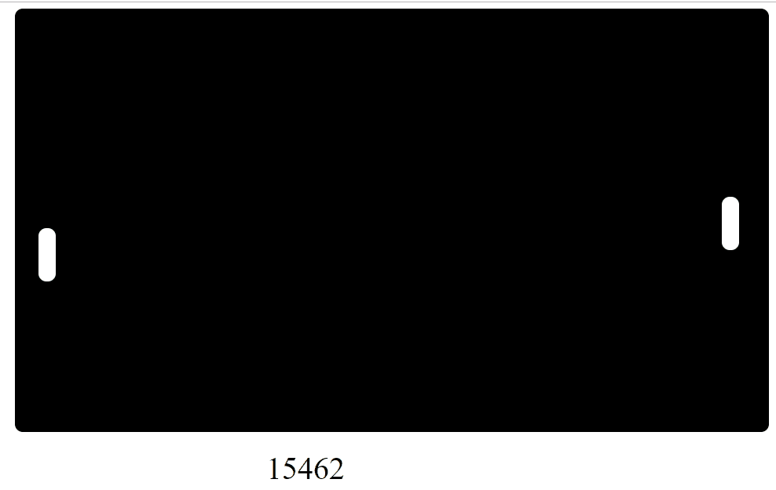
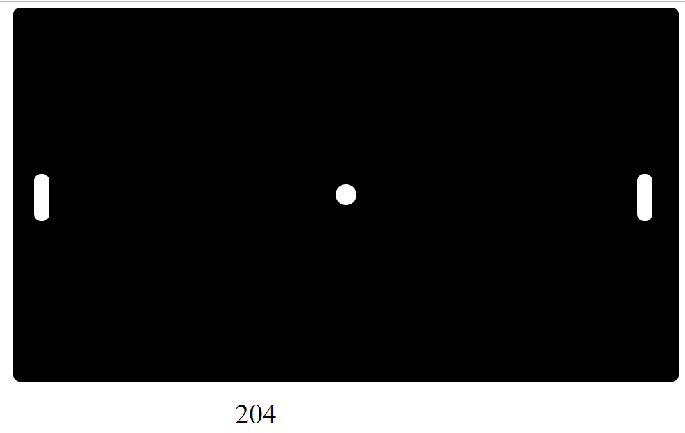
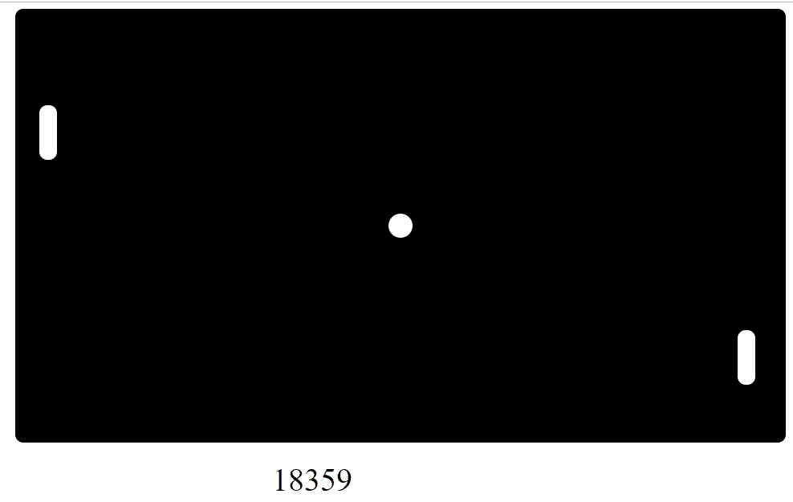

Na busca de formas para registrar a forma como os eventos são tratados no programa - e também adiantando um pouco do trabalho que será necessário para realizar a movimentação da bolinha -, adicionei um contador na parte inferior, que é incrementado a cada milisegundo.

Naturalmente, o contador vai desaparecer na versão final do jogo, ou pelo menos é o esperado. Mesmo assim, não foi de todo inútil esse pequeno teste, já que consegui confirmar que posso utilizar da mesma estrutura para registrar dois eventos acontecendo ao mesmo tempo.

```
type Msg 
    = KeyPressed Key
    | Tick Time.Posix
```

Essa, no momento era a forma em que eu estava tratando as entradas do jogador. Na primeira tentativa, busquei inspiração na estrutura comentada no [último post](https://lucasschurer.github.io/elm-pong/07-04-2019-1), modificando um pouco a forma como as entradas seriam recebidas.
  - O programa busca entradas do teclado.
  - As entradas válidas (W/S/DownArrow/UpArrow/Space) são registradas como uma ação do jogador.
  - Entradas válidas recebem um "código" ao lado, indicando qual foi o jogador que pressionou. (1 para o retângulo da esquerda, 2 para o da direita e 0 para comandos que independem de jogadores, como o espaço.)
  - Ações das entradas do teclado são separadas de três formas, jogador 1, 2 e comandos do sistema.
  - O jogo é atualizado com base nas ações processadas no último passo.
  
Para notarmos as diferenças, abaixo estão a forma como eram tomadas as decisões antes e em seguida como ficaram depois da modificação:

<details>
  <summary>Antigo</summary>

```
update : Msg -> Model -> ( Model, Cmd Msg )
update msg model = 
    case msg of 
        KeyPressed key ->
            case key of
                Up -> 
                    if validMovement model.game model.player1 2 then
                        ( { model | player1 = updatePlayer model.player1 -1 }
                        , Cmd.none 
                        )

                    else 
                        ( model
                        , Cmd.none 
                        )
                
                Down ->
                    if validMovement model.game model.player1 1 then
                        ( { model | player1 = updatePlayer model.player1 1 }
                        , Cmd.none 
                        )

                    else 
                        ( model
                        , Cmd.none 
                        )
                
                W ->
                    if validMovement model.game model.player2 2 then
                        ( { model | player2 = updatePlayer model.player2 -1 }
                        , Cmd.none 
                        )

                    else 
                        ( model
                        , Cmd.none 
                        )
                
                S ->
                    if validMovement model.game model.player2 1 then
                        ( { model | player2 = updatePlayer model.player2 1 }
                        , Cmd.none 
                        )

                    else 
                        ( model
                        , Cmd.none 
                        )
                
                Space ->
                    ( model, Cmd.none ) 
                
                None ->
                    ( model, Cmd.none ) 
      
        Tick time ->
            ( { model | time = model.time + 1, ball = updateBall model.ball }
            , Cmd.none ) 
```

</details>

<details>
  <summary>Novo</summary>
  
```
update : Msg -> Model -> ( Model, Cmd Msg )
update msg model = 
    case msg of 
        KeyPressed key player->
            case player of
                1 ->
                    case key of
                        Up -> 
                            if validMovement model.game model.player1 2 then
                                ( { model | player1 = updatePlayer model.player1 -1 }
                                , Cmd.none 
                                )

                            else 
                                ( model
                                , Cmd.none 
                                )
                        
                        Down ->
                            if validMovement model.game model.player1 1 then
                                ( { model | player1 = updatePlayer model.player1 1 }
                                , Cmd.none 
                                )

                            else 
                                ( model
                                , Cmd.none 
                                )
                    
                2 ->
                    case key of
                        W ->
                            if validMovement model.game model.player2 2 then
                                ( { model | player2 = updatePlayer model.player2 -1 }
                                , Cmd.none 
                                )

                            else 
                                ( model
                                , Cmd.none 
                                )
                        
                        S ->
                            if validMovement model.game model.player2 1 then
                                ( { model | player2 = updatePlayer model.player2 1 }
                                , Cmd.none 
                                )

                            else 
                                ( model
                                , Cmd.none 
                                )

                0 ->
                    case key of
                        Space ->
                            ( model, Cmd.none ) 
                        
                        None ->
                            ( model, Cmd.none ) 
      
        Tick time ->
            ( { model | time = model.time + 1, ball = updateBall model.ball }
            , Cmd.none ) 
```

</details>

\
Depois dessa super reestruturação na lógica, finalmente chegamos em algum lugar.

Exceto que não, não chegamos em lugar algum. O jogo continuava com o mesmo problema na movimentação simultânea dos dois jogadores.

Mesmo assim, ter tentado essa outra forma fez com que eu percebesse onde poderia estar o erro. Até o momento, eu estava pensando na distinção de uma tecla apertada pelo jogador 1 ou 2, e na tentativa acima, tentei corrigir isso criando testes para definir se o jogador 2 ou 1 havia pressionado o botão, mas depois que aquilo já havia sido enviado em um evento.

Não existe nada de errado nessa lógica, só que eu estava implementando de uma maneira não muito inteligente. Decidi fazer de uma outra maneira, usando do código "novo" de verificação, mas mudando um pouco a forma como os eventos estavam sendo registrados.

```
type Msg 
    = Player1 Key
    | Player2 Key
    | System Key
    | Tick Time.Posix
```

  - O programa busca entradas do teclado.
  - Toda vez que uma tecla é apertada, o programa traduz o código para uma palavra. 
  - Caso o que foi traduzido seja "UpArrow" ou "DownArrow", registra o evento como uma entrada do Player1.
  - Caso o que foi traduzido seja "W" ou "S", registra o evento como uma entrada do Player2.
  - Todo o resto é enviado como um evento do Sistema, que pode ser "Space" ou simplesmente qualquer outra tecla que não será usada.
  - O jogo é atualizado conforme as ações dos jogadores.
  
<details>
  <summary>Novo agora sim</summary>
    
```
update : Msg -> Model -> ( Model, Cmd Msg )
update msg model = 
    case msg of 
        Player1 key ->
            case key of
                Up -> 
                    if validMovement model.game model.player1 2 then
                        ( { model | player1 = updatePlayer model.player1 -1 }
                        , Cmd.none 
                        )

                    else 
                        ( model
                        , Cmd.none 
                        )
                
                Down ->
                    if validMovement model.game model.player1 1 then
                        ( { model | player1 = updatePlayer model.player1 1 }
                        , Cmd.none 
                        )

                    else 
                        ( model
                        , Cmd.none 
                        )
                
                _ ->
                    ( model, Cmd.none )

        Player2 key ->
            case key of
                W ->
                    if validMovement model.game model.player2 2 then
                        ( { model | player2 = updatePlayer model.player2 -1 }
                        , Cmd.none 
                        )

                    else 
                        ( model
                        , Cmd.none 
                        )
                
                S ->
                    if validMovement model.game model.player2 1 then
                        ( { model | player2 = updatePlayer model.player2 1 }
                        , Cmd.none 
                        )

                    else 
                        ( model
                        , Cmd.none 
                        )
                
                _ ->
                    ( model, Cmd.none )

        System key ->
            case key of
                Space ->
                    ( model, Cmd.none ) 
                
                _ ->
                    ( model, Cmd.none ) 
      
        Tick time ->
            ( { model | time = model.time + 1, ball = updateBall model.ball }
            , Cmd.none ) 
```

</details>

\
Finalmente a movimentação estava resolvida, como podemos observar:



Er...

Também não deu certo.

Quer dizer, não totalmente, afinal de contas, agora podemos mover as duas ao mesmo tempo se apertarmos "W/S" + "UpArrow/DownArrow" juntas.



Encarei isso como uma pequena vitória, até decidir tirar uma dúvida que estava na minha cabeça. Abri o programa antigo, antes das mudanças e decidi testar se era possível movimentar os dois retângulos ao mesmo tempo caso pressionasse as duas teclas juntas.

No final das contas, já era possível fazer isso. Eu só não havia testado.

Acho que é melhor dar um tempo na otimização da movimentação e passar para completar o jogo, afinal de contas, se eu ficar parado nessa parte podemos substituir Pong por "Dois retângulos que podem se mover de maneira fluída mas não fazem mais nada."

Hora de fazer a bolinha ricochetear.


